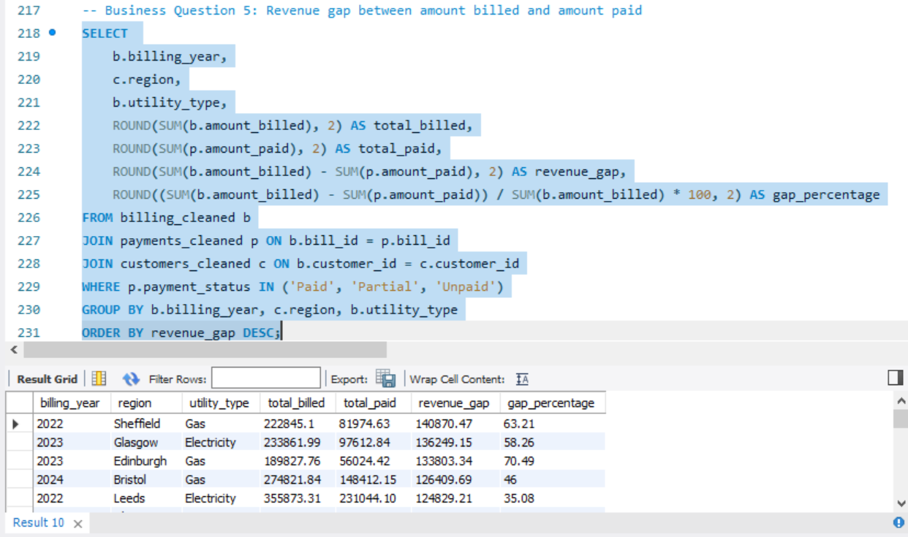
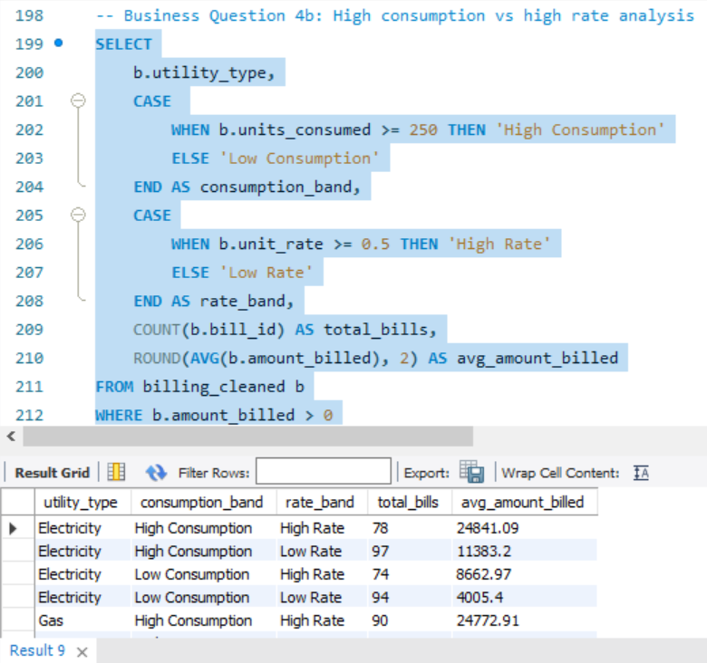
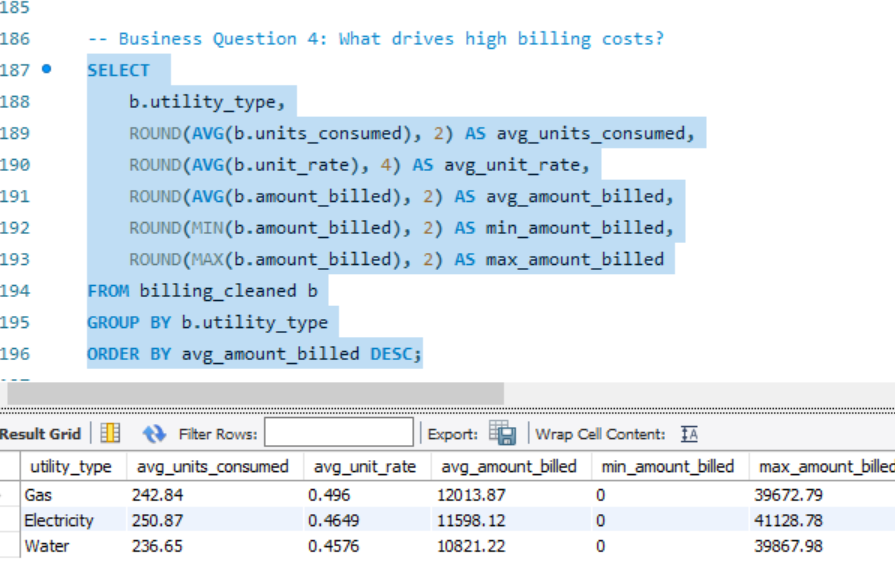
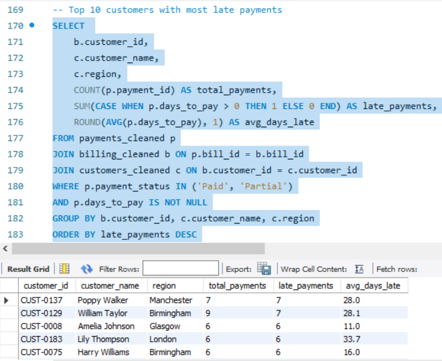
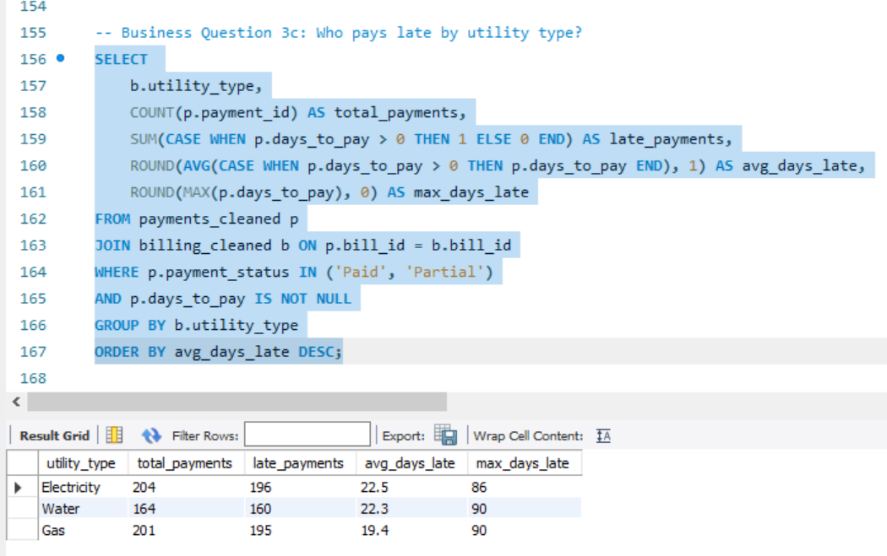
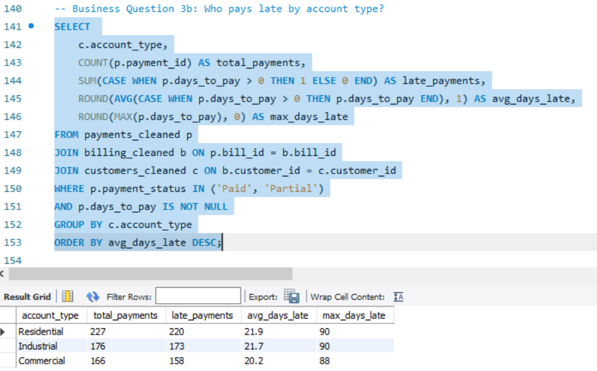
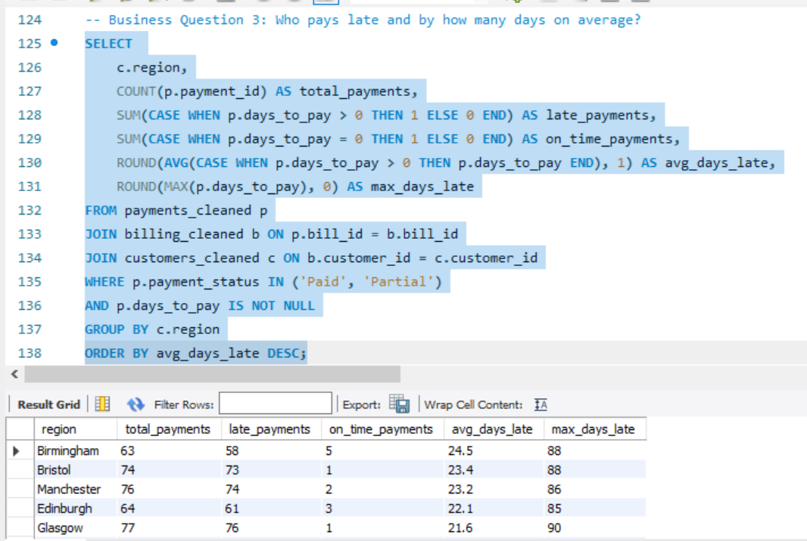
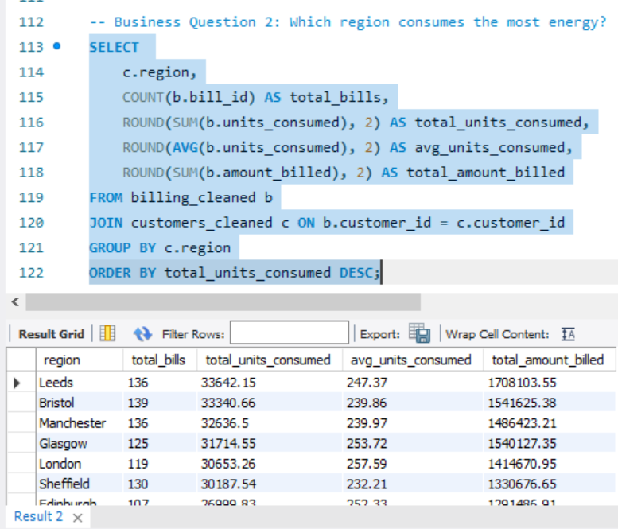
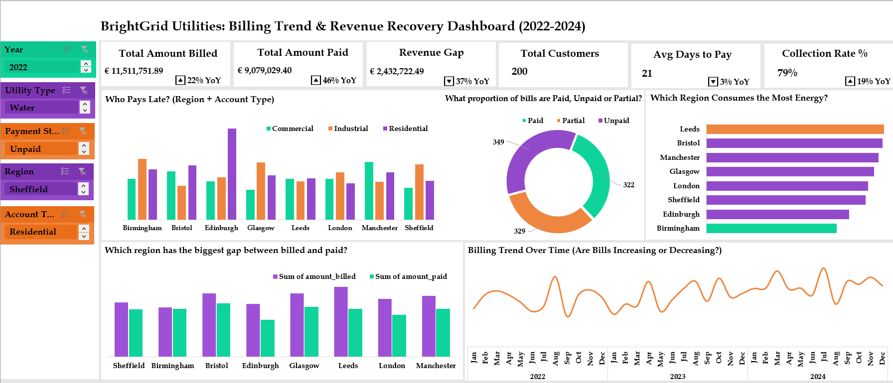

# Utility Billing Trend Analysis
### Revenue Recovery, Consumption Patterns & Payment Behaviour Across UK Regions

---

## Table of Contents

- [Project Overview](#project-overview)
- [Business Objectives](#business-objectives)
- [About the Data](#about-the-data)
- [Methodology](#methodology)
- [Data Cleaning Process](#data-cleaning-process)
- [Analysis Results and Key Findings](#analysis-results-and-key-findings)
- [Dashboard](#dashboard)
- [Recommendations](#recommendations)
- [Limitations](#limitations)
- [Conclusion](#conclusion)

---

## Project Overview

BrightGrid Utilities Ltd is a mid-sized UK utility provider operating across eight major cities; London, Manchester, Birmingham, Leeds, Glasgow, Bristol, Edinburgh, and Sheffield. The company supplies Electricity, Gas, and Water to a diverse customer base spanning Residential, Commercial, and Industrial account types.

Over the period 2022 to 2024, BrightGrid has processed over 1,000 billing records and 1,000 payment transactions. Despite strong billing volumes totalling over £11.5 million in the analysis period, the company faces growing concerns around payment defaults, regional consumption imbalances, and a widening gap between amounts billed and amounts collected.

This analysis was commissioned to provide the leadership team with a data-driven understanding of billing trends, regional energy consumption, customer payment behaviour, and revenue recovery performance. The findings are intended to support strategic decisions across Finance, Operations, and Customer Services.

---

## Business Objectives

The management team identified five core questions to guide the analysis:

1. Are utility bills increasing or decreasing over time?
2. Which region consumes the most energy?
3. Who pays late, and by how many days on average?
4. What drives high billing costs, consumption volume or unit rate?
5. What is the revenue gap between amounts billed and amounts collected?

---

## About the Data

The dataset was sourced internally from BrightGrid's billing and customer management systems and consists of three relational tables covering the period January 2022 to December 2024.

| Table | Records | Key Columns |
|---|---|---|
| `customers` | 200 | customer_id, customer_name, region, account_type, join_date |
| `billing` | 1,000 | bill_id, customer_id, utility_type, billing_month, billing_year, units_consumed, unit_rate, amount_billed |
| `payments` | 1,000 | payment_id, bill_id, payment_status, amount_paid, due_date, payment_date, days_to_pay |

---

## Methodology

The analysis was conducted in three phases using Microsoft Excel and MySQL, with visualisations built in Excel using PivotTables connected through a Data Model.

### Phase 1: Data Cleaning (Excel / Power Query)
- Raw CSV files loaded into Excel via **Get Data → From Text/CSV** to preserve date formatting
- Power Query used for deduplication, standardisation, and calculated column creation across all 3 tables
- Data types set correctly before loading back into Excel

### Phase 2: Analysis (MySQL)
- Cleaned datasets imported into MySQL for SQL-based analysis
- Five business questions answered using structured SQL queries with JOIN operations across all three tables
- Aggregation functions used: `SUM`, `AVG`, `COUNT`, `MAX`, `ROUND`
- `CASE` statements used to segment records by consumption band, rate band, and payment status

### Phase 3: Visualisation (Excel Dashboard)
- PivotTables built from a Data Model connecting all three cleaned tables
- Table relationships defined: `billing → customers` via `customer_id`; `payments → billing` via `bill_id`
- Five PivotCharts created and arranged on a Dashboard sheet
- Six KPI cards added showing Total Amount Billed, Total Amount Paid, Revenue Gap, Total Customers, Avg Days to Pay, and Collection Rate
- Slicers added for interactive filtering by Year, Region, Utility Type, Account Type, and Payment Status
- Year-on-Year change indicators added to each KPI card

---

## Data Cleaning Process

Data cleaning was performed in Microsoft Excel using Power Query. The raw CSV files were loaded directly via **Get Data → From Text/CSV** to prevent Excel from auto-formatting dates. All three tables were cleaned systematically before analysis.

---

### Customers Table

**Step 1: Remove Duplicates**
The table was loaded into Power Query and the Remove Duplicates function was applied across all columns. 5 duplicate rows were identified and removed, leaving 200 unique customer records.

**Step 2: Fix Missing Customer Names**
The `customer_name` column was filtered for null values. 6 blank records were identified and replaced with the value `'Unknown'` using Power Query's Replace Values function. This preserves the customer record while clearly flagging the missing information.

**Step 3: Standardise join_date Format**
The `join_date` column contained dates stored as text in DD/MM/YYYY format. The data type was changed using **'Using Locale'** with English (United Kingdom) selected to ensure correct day-first interpretation. The column was then formatted as DD/MM/YYYY on load back into Excel.

---

### Billing Table

**Step 1: Remove Duplicates**
20 duplicate rows were removed using Power Query's Remove Duplicates function, leaving 1,000 clean billing records.

**Step 2: Standardise utility_type**
The `utility_type` column contained inconsistent casing including `'electricity'`, `'ELECTRICITY'`, and a spelling error `'Electrcity'`. The **Transform → Format → Capitalize Each Word** function was applied first, then Replace Values was used to correct the typo. The column now contains exactly 3 clean values: `Electricity`, `Water`, `Gas`.

**Step 3: Fix Negative units_consumed**
30 rows contained negative values in the `units_consumed` column. Since units consumed are calculated automatically by the billing system, negative values indicate a system sign error. The **Transform → Scientific → Absolute Value** function was applied to convert all negative values to their positive equivalents.

**Step 4: Flag Zero units_consumed**
19 rows contained a `units_consumed` value of zero. These were retained but flagged using a calculated column called `data_flag` with the value `'Zero consumption - verify meter'`.

**Step 5: Recalculate amount_billed**
Approximately 19 rows had blank `amount_billed` values. A new calculated column `amount_billed_clean` was created using the formula: `units_consumed × unit_rate × 100`. Rows where `units_consumed = 0` were also corrected to show `amount_billed = 0`.

**Step 6: Add billing_month_name**
A calculated column `billing_month_name` was added using Power Query to produce short month names (Jan, Feb, Mar etc.) from the `billing_month` number for use in charts and dashboards.

---

### Payments Table

**Step 1: Remove Duplicates**
10 duplicate rows were removed, leaving 1,000 clean payment records.

**Step 2: Standardise Date Formats**
Both `due_date` and `payment_date` columns were converted to proper Date type using **'Using Locale'** with English (United Kingdom) selected in Power Query. Dates were formatted as DD/MM/YYYY on load into Excel.

**Step 3: Add days_to_pay Column**
A calculated column `days_to_pay` was created to calculate the number of days between the due date and actual payment date. Null values are returned for Unpaid records where no payment date exists.

**Step 4: Add payment_flag Column**
A calculated column `payment_flag` was added to categorise each payment record:
- `'No payment made'`: for all Unpaid records
- `'Partial - date missing'`: for Partial records with no `payment_date`
- `'Partial - amount missing'`: for Partial records with no `amount_paid`
- `'OK'`: for all clean Paid and complete Partial records

---

## Analysis Results and Key Findings

### 1. Are Utility Bills Increasing or Decreasing?

- Utility billing has grown consistently year-over-year, with a total increase of **28% from 2022 to 2024**
- 2024 recorded both the highest number of bills (371) and the highest total amount billed (£4.4M)
- The sharpest growth occurred between 2023 and 2024, suggesting accelerating demand or rate increases

---

### 2. Which Region Consumes the Most Energy?

- Leeds is the highest consuming region with **33,642 total units**; 37% more than Birmingham which ranks last
- London has the highest average consumption per bill **(257.59 units)** despite ranking 5th overall, indicating fewer but heavier-consuming customers
- Birmingham is the lowest consuming region, suggesting either a smaller customer base or more energy-efficient usage patterns

---

### 3. Who Pays Late?

**By Region:**

- Birmingham customers pay the latest on average **24.5 days** after the due date
- London customers are the most prompt but still average **18.4 days late** no region pays on time

**By Account Type:**

- Residential customers are the worst payers across all account types, averaging **21.9 days late**

**By Utility Type:**

- Electricity bills take the longest to pay **(22.5 days avg)** compared to Gas (19.4 days avg)

**By Customer:**

- William Taylor (Birmingham) and Poppy Walker (Manchester) are the most consistently late individual customers

---

### 4. What Drives High Billing Costs?

- High consumption is the primary driver of high billing costs when combined with a high unit rate, bills average over **£25,000**
- Gas has the highest average bill **(£12,014)** despite lower consumption than Electricity driven by a higher unit rate (£0.496)
- Water bills reach **£25,367** on average when both consumption and rate are high the highest of all utility types in this scenario
- Low consumption + low rate combinations result in bills as low as **£3,264**

---

### 5. Revenue Gap: Billed vs Collected

- Edinburgh Gas 2023 has the worst collection rate only **29.5p collected for every £1 billed**
- Leeds Water 2023 is the most alarming a **91.83% revenue gap** meaning only 8p collected per £1 billed
- Gas utility consistently shows the largest revenue gaps across multiple regions and years
- **13 region/year/utility combinations** show overpayments where amount paid exceeds amount billed warranting billing system investigation
- Overall collection rate stands at **79%**, meaning **£2.43M** of the £11.5M billed remains unrecovered

---

## Dashboard

[View Interactive Dashboard Here](Utility_Billing_Trend_Analysis_1/Utility_Billing_Trend_Analysis_1.xlsx)

The interactive dashboard was built in Microsoft Excel using PivotTables connected through a Data Model. It provides a comprehensive single-view summary of all five business questions and can be filtered dynamically using slicers on the left panel.

---

### Dashboard Insights

**KPI Cards**

- Total Amount Billed of **£11.5M** with a 22% YoY increase confirms billing is growing strongly year on year
- Total Amount Paid of **£9.08M** represents a 79% collection rate meaning approximately £1 in every £5 billed is not being recovered
- The Revenue Gap of **£2.43M** has reduced by 37% YoY a positive sign that collections are improving despite higher billing volumes
- Average Days to Pay of **21 days** with a -3% YoY improvement suggests a very slight positive trend in payment speed
- Total Customers: **200**

---

**Chart 1: Who Pays Late? (Region + Account Type)**

- Edinburgh stands out with a notably tall Residential bar Residential customers in Edinburgh are among the slowest payers in the entire network
- Birmingham shows consistently elevated bars across all three account types, confirming it as the most problematic region overall
- Commercial customers are consistently the shortest in every region, confirming they are the most prompt payers
- When filtered by Utility Type to Water, late payment bars increase significantly across most regions, suggesting Water billing has a collection timing problem

---

**Chart 2: Payment Status Breakdown (Donut Chart)**

- The donut chart shows **349 Paid, 322 Unpaid, and 329 Partial** records a near equal three-way split
- This means only approximately **35% of all payment records are fully settled** a significant concern for cash flow
- Filtering by Region shows Birmingham and Sheffield have higher Unpaid proportions than London and Bristol
- Filtering by Utility Type shows Gas has the highest proportion of Unpaid records across all three utility types

---

**Chart 3: Which Region Consumes the Most Energy?**

- Leeds dominates with the longest bar, confirming it as the highest consuming region across all utility types
- Birmingham's bar is noticeably shorter than all other regions the lowest consuming city in the network
- When filtered by Gas only, the gap between regions narrows, suggesting Gas consumption is more evenly distributed than Electricity or Water
- Filtering by 2024 shows consumption increased most sharply in Leeds and Manchester compared to 2022

---

**Chart 4: Revenue Gap by Region**

- Leeds shows the largest absolute gap the billed bar significantly exceeds the paid bar
- Bristol and Manchester show relatively smaller gaps their green bars are closer to the purple bars than other regions
- When filtered by Gas, the gap widens dramatically for Edinburgh and Sheffield, confirming Gas is the biggest revenue recovery problem
- Filtering by 2022 vs 2024 shows the gap has narrowed in most regions by 2024, consistent with the KPI improvement in collection rate

---

**Chart 5: Billing Trend Over Time**

- A clear upward trend is visible from 2022 to 2024 with billing volumes growing in each successive year
- Peak billing months are consistently **March, April, July, and November** across all three years, likely reflecting seasonal demand patterns
- A consistent seasonal dip is visible in **June and September** every year, potentially reflecting lower energy usage in early summer
- The 2024 line sits noticeably higher than 2022 and 2023 for most months, confirming the 22% YoY billing growth

---

## Recommendations

### 1. Prioritise Gas Collections: Especially Edinburgh and Sheffield
Gas consistently records the largest revenue gaps (£905K in 2024) and the worst individual collection rates. Edinburgh Gas 2023 collected only 29.5p per £1 billed. Targeted collections campaigns with dedicated account managers for Gas customers in these cities are strongly recommended.

### 2. Address the Water Collection Problem
Water has the lowest collection rate of all utility types at 76% in 2024. Despite lower billing volumes, Water's collection efficiency is worse than Gas and Electricity. BrightGrid should investigate whether Water billing cycles, bill clarity, or customer affordability are contributing to this pattern.

### 3. Introduce Early Payment Incentives
No region or account type pays on time. All average between 18 and 25 days late. Small early payment discounts or loyalty points for on-time payment could meaningfully reduce the 21-day average and improve cash flow predictability.

### 4. Target Edinburgh Residential Customers
Edinburgh Residential customers emerged as the single worst-performing segment in 2024 the tallest bar in the late payment chart across all regions and account types. A dedicated outreach programme including payment plan options and SMS reminders is recommended specifically for this segment.

### 5. Structure Partial Payment Plans
Nearly one third of all payment records are Partial. The 2024 dashboard shows 116–128 Partial records depending on the utility type filter. Converting these into structured instalment plans would reduce the Partial category and improve revenue predictability without requiring full immediate payment from customers.

### 6. Investigate Meter Readings in Birmingham
Birmingham consistently ranks last in energy consumption across all three years and all utility types. This warrants an operational review to confirm whether the low consumption reflects genuine usage patterns or potential meter reading inaccuracies.

### 7. Leverage the 2024 Collections Improvement
The jump from 71% to 85% collection rate between 2023 and 2024 is significant. BrightGrid should identify which specific initiatives or operational changes drove this improvement and scale them across all regions and utility types to sustain and build on this momentum.

---

## Limitations

- Negative `units_consumed` values were converted to absolute values based on the assumption of a system sign error. In a real-world scenario, this decision would require confirmation from the data owner before implementation
- Overpayment cases were flagged but not resolved within this analysis further investigation with the Finance team is required

---

## Conclusion

This analysis of BrightGrid Utilities Ltd's billing and payment data reveals a utility operation experiencing strong revenue growth from £3.46M in 2022 to £4.43M in 2024 alongside a meaningful improvement in collections efficiency that deserves recognition.

The most significant story in the data is the **2023 collections crisis and the 2024 recovery**. In 2023 the revenue gap peaked at £1.04M and collection rate dropped to 71%, the worst performance in the three-year period. By 2024 this had reversed dramatically to an 85% collection rate and only £655K gap. Understanding what drove this turnaround is as important as addressing remaining weaknesses.

Water utility emerges as an unexpected concern despite lower billing volumes, it has the lowest collection rate (76%) of all three utility types. Gas generates the largest absolute revenue gap. Edinburgh Residential is the single worst-performing customer segment in 2024. These three findings should be prioritised in the next operational planning cycle.

The interactive dashboard provides BrightGrid's leadership with a powerful tool to monitor these metrics in real time filtering by year, region, utility type, account type, and payment status to identify emerging problems before they escalate. Combined with the recommendations in this report, BrightGrid is well positioned to close the remaining revenue gap, improve payment timeliness, and deliver consistent service across all eight regions.
